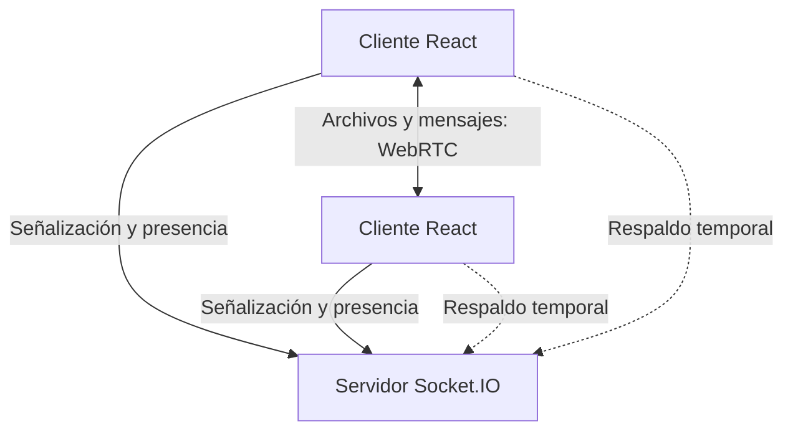

# DropThings

> **Share whatever you want, wherever you want.**

DropThings permite compartir archivos y mensajes directamente entre dispositivos mediante salas temporales, códigos QR, WebRTC y un servidor ligero de señalización. Los archivos no se almacenan de forma permanente en el servidor.

Aplicación pública: [dropthings.vercel.app](https://dropthings.vercel.app)

## Funcionalidades

- Salas temporales accesibles por código o QR.
- Transferencias directas mediante canales de datos WebRTC.
- Relé de respaldo mediante Socket.IO cuando el canal P2P no está disponible.
- Mensajería por sala y alias locales de dispositivo.
- Protección opcional por PIN y delegación de administradores.
- Historial local de transferencias y salas recientes.
- Escaneo de QR desde la cámara o desde una imagen.

## Arquitectura



- `src/`: aplicación React, interfaz, almacenamiento local y gestor WebRTC.
- `shared/protocol.ts`: validaciones y límites compartidos por navegador y servidor.
- `server.ts`: señalización, presencia, autorización de salas y relé de respaldo.
- `public/`: favicon, manifiesto e iconos de la marca DropThings para navegadores, Apple, Android/PWA, Safari y Windows.

Las salas viven en memoria y se eliminan diez minutos después de que salga el último participante. Reiniciar el servidor elimina todas las salas activas.

## Desarrollo local

Requisitos: Node.js 22 o superior y npm 10 o superior.

```bash
npm install
cp .env.example .env
npm run dev
```

La aplicación completa se sirve en `http://localhost:3000`. El servidor de desarrollo integra Vite como middleware, por lo que no es necesario iniciar dos procesos.

Comandos disponibles:

| Comando | Uso |
|---|---|
| `npm run dev` | Aplicación y servidor con recarga en desarrollo |
| `npm run typecheck` | Comprobación estricta de TypeScript |
| `npm run build` | Bundle del cliente y del servidor |
| `npm run start` | Ejecutar el bundle de producción |
| `npm run check` | Typecheck y build completos |
| `npm run clean` | Eliminar la salida `dist/` |

## Variables de entorno

### Navegador

| Variable | Descripción |
|---|---|
| `VITE_SIGNALING_URL` | URL del servicio Socket.IO. Vacía cuando cliente y servidor comparten origen. |
| `VITE_ICE_SERVERS` | Lista separada por comas de servidores STUN/TURN. |

### Servidor

| Variable | Descripción |
|---|---|
| `PORT` | Puerto HTTP; por defecto `3000`. |
| `PUBLIC_APP_URL` | Origen público principal del cliente. |
| `ALLOWED_ORIGINS` | Orígenes CORS permitidos, separados por comas. |
| `NODE_ENV` | Usa `production` para servir el contenido compilado de `dist/`. |

Para redes corporativas o CGNAT conviene configurar un servidor TURN propio dentro de `VITE_ICE_SERVERS`; STUN por sí solo no garantiza conectividad entre todas las redes.

## Despliegue

El frontend canónico está en Vercel. Este repositorio compila también `server.ts` como un proceso Node persistente. Si la publicación de Vercel sirve únicamente el bundle estático de Vite, despliega el servidor de señalización por separado y configura su URL en `VITE_SIGNALING_URL`. Si se adapta el backend a Vercel Functions, deben respetarse los límites de duración y reconexión de las conexiones WebSocket descritos en la [documentación de Vercel](https://vercel.com/docs/functions/websockets).

Antes de publicar:

1. Configura `PUBLIC_APP_URL=https://dropthings.vercel.app`.
2. Restringe `ALLOWED_ORIGINS` a los dominios reales del frontend.
3. Configura `VITE_SIGNALING_URL` cuando el backend use otro dominio.
4. Ejecuta `npm run check`.
5. Verifica dos navegadores o dispositivos reales, incluido un caso con PIN.

## Seguridad y privacidad

- El servidor valida que cada evento pertenezca a la sala y al par de destino.
- La autoridad administrativa se acredita con tokens aleatorios emitidos por el servidor; nunca se confía en una bandera `isCreator` enviada por el cliente.
- Los PIN se derivan con `scrypt`, solo se conservan en memoria y no se retransmiten a los participantes.
- Los canales WebRTC usan el cifrado de transporte definido por WebRTC.
- El respaldo Socket.IO pasa por el servidor y depende de HTTPS/WSS en producción; no debe describirse como transferencia P2P.
- Los archivos recibidos se ensamblan actualmente en memoria en el navegador. Para archivos muy grandes se recomienda evolucionar hacia Streams API y escritura progresiva en disco.
- El historial, los alias, las credenciales administrativas y los PIN utilizados se guardan en el almacenamiento local del navegador. No uses un dispositivo compartido para salas sensibles.

DropThings ofrece salas efímeras, no cuentas de usuario ni almacenamiento permanente. Un código de sala o PIN compartido concede acceso a esa sesión.

## Identidad de producto

- Nombre escrito siempre como **DropThings**.
- Lema oficial: **“Share whatever you want, wherever you want.”**
- Interfaz principal en español; el lema se conserva en inglés.
- URL canónica: `https://dropthings.vercel.app`.

## Licencia

No se ha definido todavía una licencia pública. Hasta que se añada un archivo `LICENSE`, se mantienen todos los derechos reservados por el propietario del repositorio.
